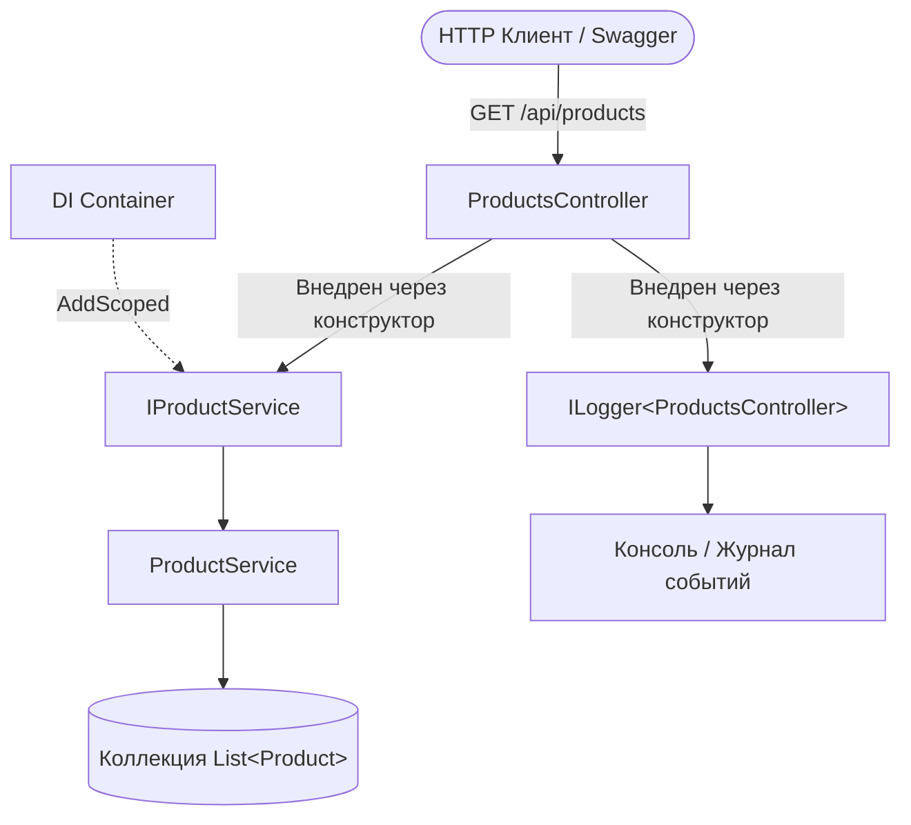

# Практическая работа 03: Внедрение зависимостей (Dependency Injection) и Логирование

## Цель работы
На практике разобраться, как работает механизм внедрения зависимостей (Dependency Injection, DI) в ASP.NET Core:
1. Создание сервисов и абстракций (интерфейсов).
2. Регистрация сервисов в DI-контейнере с использованием жизненного цикла `Scoped` (`builder.Services.AddScoped<IProductService, ProductService>()`).
3. Внедрение зависимостей в контроллер через конструктор (Constructor Injection).
4. Использование встроенной инфраструктуры логирования `ILogger<T>` для записи диагностических сообщений различных уровней (`Information`, `Warning`, `Error` и др.).
5. Конфигурирование уровней логирования через `appsettings.json`.

---

## Архитектура приложения

### Жизненный цикл обработки запроса (Request Lifecycle)
```text
HTTP Request (GET /api/products)
        │
        ▼
ProductsController
        │
        ├──► запрашивает IProductService
        │           │
        │           ▼
        │     DI Container (ASP.NET Core)
        │           │ (разрешает зависимость через AddScoped)
        │           ▼
        │     ProductService
        │           │
        │           ▼
        │     List<Product>
        │
        └──► использует ILogger<ProductsController>
                    │
                    ▼
              Logging System (Console / Debug output)
```



---

## Структура проекта

```text
Web_service_development_modul_03-pra_03/
├── .gitignore                          # Исключение временных файлов, bin/, obj/, .vs/
├── ProductsApi.sln                     # Файл решения .NET
├── README.md                           # Документация практической работы
├── DESIGN_AND_ANSWERS.md               # Подробный архитектурный анализ и ответы на вопросы
└── src/
    └── ProductsApi/
        ├── Controllers/
        │   └── ProductsController.cs   # API Контроллер с DI и логированием
        ├── Models/
        │   └── Product.cs              # Доменная модель товара
        ├── Services/
        │   ├── IProductService.cs      # Интерфейс бизнес-логики
        │   └── ProductService.cs       # Реализация сервиса товаров
        ├── Properties/
        │   └── launchSettings.json     # Профили запуска и Swagger UI
        ├── appsettings.json            # Базовые настройки логирования
        ├── appsettings.Development.json# Настройки для среды разработки
        ├── Program.cs                  # Точка входа, регистрация DI и middleware
        └── ProductsApi.csproj          # Файл проекта ASP.NET Core
```

---

## Спецификация Endpoints

| HTTP Method | URL | Назначение | Коды ответов |
|---|---|---|---|
| `GET` | `/api/products` | Получить список всех товаров | `200 OK` |
| `GET` | `/api/products/{id}` | Получить товар по его уникальному ID | `200 OK`, `404 Not Found` |
| `GET` | `/api/products/test-logs` | Демонстрационный метод для проверки уровней логирования | `200 OK` |
| `GET` | `/swagger` | Интерактивная документация Swagger UI | `200 OK` |

---

## Модель данных `Product`

```csharp
public class Product
{
    public int Id { get; set; }
    public string Name { get; set; } = string.Empty;
    public decimal Price { get; set; }
}
```

| Свойство | Тип | Описание |
|---|---|---|
| `Id` | `int` | Уникальный числовой идентификатор товара |
| `Name` | `string` | Наименование товара |
| `Price` | `decimal` | Стоимость товара в валюте |

---

## Примеры запросов и ответов

### 1. Получить все товары (`GET /api/products`)
**HTTP-ответ:** `200 OK`
```json
[
  {
    "id": 1,
    "name": "Laptop",
    "price": 350000
  },
  {
    "id": 2,
    "name": "Mouse",
    "price": 12000
  },
  {
    "id": 3,
    "name": "Keyboard",
    "price": 25000
  }
]
```

### 2. Получить товар по ID (`GET /api/products/1`)
**HTTP-ответ:** `200 OK`
```json
{
  "id": 1,
  "name": "Laptop",
  "price": 350000
}
```

### 3. Запрос несуществующего товара (`GET /api/products/100`)
**HTTP-ответ:** `404 Not Found`
```json
null
```

---

## Логирование событий (`ILogger<ProductsController>`)

В контроллере логируются основные ключевые события:
- **`LogInformation`** при запросе всех товаров:
  ```text
  info: ProductsApi.Controllers.ProductsController[0]
        Getting all products
  ```
- **`LogInformation`** при успешном нахождении товара:
  ```text
  info: ProductsApi.Controllers.ProductsController[0]
        Product with ID 1 was found
  ```
- **`LogWarning`** при отсутствии товара с указанным ID:
  ```text
  warn: ProductsApi.Controllers.ProductsController[0]
        Product with ID 100 was not found
  ```

### Демонстрация уровней логирования (`test-logs`)
При вызове метода `test-logs` приложение генерирует сообщения всех уровней:
```text
info: ProductsApi.Controllers.ProductsController[0]
      Information message
warn: ProductsApi.Controllers.ProductsController[0]
      Warning message
fail: ProductsApi.Controllers.ProductsController[0]
      Error message
crit: ProductsApi.Controllers.ProductsController[0]
      Critical message
```
*(Сообщения `Trace` и `Debug` фильтруются, так как минимальный уровень `Default` в `appsettings.json` равен `Information`)*.

---

## Ключевые шаги выполнения и обсуждения

### Шаг 3. Почему контроллеру лучше работать с `IProductService`, а не напрямую с `ProductService`?
1. **Слабая связанность (Loose Coupling):** Контроллер зависит от абстрактного интерфейса, а не от деталей реализации. Реализацию можно изменить в любой момент (например, заменить список в памяти на БД через EF Core) без изменения кода контроллера.
2. **Тестируемость:** Контроллер легко покрывать модульными тестами, подставляя mock-реализацию `IProductService`.
3. **Соблюдение SOLID:** Реализуется принцип инверсии зависимостей (DIP).

### Шаги 5–6. Проблема сильной связи и ошибка при отсутствии регистрации в DI
* При прямом вызове `new ProductService()` контроллер жестко связан с классом и сам управляет его созданием.
* Если перевести контроллер на прием `IProductService` через конструктор:
  ```csharp
  public ProductsController(IProductService service, ILogger<ProductsController> logger)
  ```
  но забыть добавить регистрацию в `Program.cs`, то при запуске и первом вызове эндпоинта ASP.NET Core выбросит исключение:
  > `System.InvalidOperationException: Unable to resolve service for type 'ProductsApi.Services.IProductService' while attempting to activate 'ProductsApi.Controllers.ProductsController'.`
  Это происходит потому, что DI-контейнер не знает, какой именно класс следует инстанцировать при запросе `IProductService`.

### Шаг 7. Регистрация зависимости (`AddScoped`)
В `Program.cs` добавляется правило:
```csharp
builder.Services.AddScoped<IProductService, ProductService>();
```
Оно указывает контейнеру создавать один экземпляр `ProductService` на время жизни HTTP-запроса (Scope) и внедрять его при запросе `IProductService`.

### Шаг 13. Управление уровнями логирования через `appsettings.json`
Если в `appsettings.json` установить:
```json
"Logging": {
  "LogLevel": {
    "Default": "Warning"
  }
}
```
Сообщения уровня `Information` перестанут выводиться в консоль, так как порог фильтрации отсекает все сообщения с уровнем ниже `Warning`. Сообщения `Warning`, `Error` и `Critical` продолжат отображаться.

---

## Ответы на контрольные вопросы

1. **Что такое Dependency Injection?**  
   Архитектурный паттерн, реализующий инверсию управления (IoC), при котором зависимости создаются и внедряются внешним контейнером, а не самим объектом.
2. **Какую проблему создает использование `new ProductService()` непосредственно в контроллере?**  
   Жесткую связь (tight coupling), невозможность мокирования в юнит-тестах, нарушение принципа единой ответственности (SRP) и усложнение изменений.
3. **Для чего нужен интерфейс `IProductService`?**  
   Для создания четкого контракта взаимодействия, абстрагирования контроллера от деталей реализации и обеспечения легкой замены логики и тестирования.
4. **Что такое Constructor Injection?**  
   Способ внедрения зависимостей, когда класс объявляет требуемые интерфейсы в качестве параметров своего конструктора.
5. **Зачем регистрировать сервис в `Program.cs`?**  
   Чтобы DI-контейнер знал соответствие между интерфейсом и реализацией, а также управлял временем жизни создаваемых объектов.
6. **Что делает `AddScoped`?**  
   Создает один экземпляр сервиса на весь жизненный цикл одного HTTP-запроса и уничтожает его по окончании обработки запроса.
7. **Для чего используется `ILogger<T>`?**  
   Для структурированной записи диагностических сообщений, ошибок и событий с автоматическим указанием категории `T`.
8. **В чем разница между `Information`, `Warning` и `Error`?**  
   `Information` — штатный ход программы; `Warning` — потенциальная проблема или неожиданная ситуация (товар не найден); `Error` — сбой операции или ошибка.
9. **Для чего используется `appsettings.json`?**  
   Для централизованного хранения конфигурационных настроек приложения (фильтры логов, строки подключения, параметры окружения).
10. **Почему слабосвязанный код проще изменять и тестировать?**  
    Потому что компоненты изолированы: замена одной части не ломает другие, а в тестах можно подменять тяжелые компоненты легкими заглушками.

*(Полный разбор содержится в файле [DESIGN_AND_ANSWERS.md](DESIGN_AND_ANSWERS.md))*.

---

## Запуск приложения

### Требования
* [.NET 9.0 SDK](https://dotnet.microsoft.com/) или выше.

### Команды для запуска

1. Клонировать репозиторий:
   ```bash
   git clone <URL_ВАШЕГО_РЕПОЗИТОРИЯ>
   cd Web_service_development_modul_03-pra_03
   ```

2. Собрать проект:
   ```bash
   dotnet build
   ```

3. Запустить API:
   ```bash
   dotnet run --project src/ProductsApi/ProductsApi.csproj
   ```

4. Открыть в браузере Swagger UI:
   - **Swagger UI:** [http://localhost:5000/swagger](http://localhost:5000/swagger)
   - **Список товаров:** [http://localhost:5000/api/products](http://localhost:5000/api/products)
   - **Товар по ID:** [http://localhost:5000/api/products/1](http://localhost:5000/api/products/1)

---

## Инструкция по отправке в GitHub

Если вы хотите отправить этот проект в свой репозиторий на GitHub:

1. Создайте новый пустой репозиторий на GitHub (например, `Web_service_development_modul_03-pra_03`).
2. В терминале в корневой папке проекта выполните:
   ```bash
   git remote add origin https://github.com/<ВАШ_ЛОГИН>/<ИМЯ_РЕПОЗИТОРИЯ>.git
   git branch -M main
   git push -u origin main
   ```
